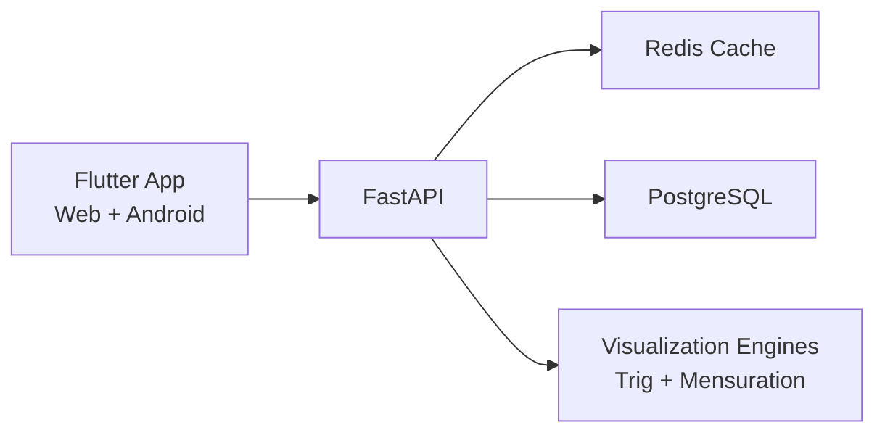
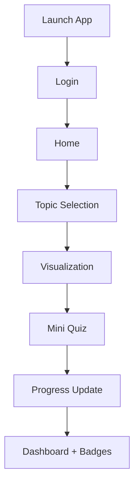

# Patashala

Patashala is a student interactive visualization app designed to make mathematics intuitive through visual exploration, simulation, and active practice.
It combines Flutter (Web + Android) with FastAPI + PostgreSQL + Redis to deliver a complete product experience across content, interaction, and progress tracking.

## Project Description
Patashala turns abstract concepts into interactive scenes that students can manipulate in real time.
Instead of static explanations, learners use controls like sliders, drag handles, and tap-driven grids to see cause-and-effect behavior instantly.

The platform focuses on:
- Visual-first learning with live feedback
- Hands-on interaction before formula memorization
- Lightweight gamification through quiz, progress, and completion states
- Clean, modern UI that keeps attention on concept understanding

## Project Goal
Help students understand:
- Trigonometry (basic visual concepts)
- Mensuration (area and perimeter)

Using:
- Interactive visualizations
- Simulation controls
- Step hints
- Mini quizzes
- Progress tracking

## Topics Covered
### Trigonometry
- Right Triangle Basics
- Sine & Cosine (visual)
- Angle Rotation
- Shadow Length Simulation

### Mensuration
- Area of Rectangle
- Area of Square
- Perimeter of Shapes
- Area by Grid Method

## Tools & Technologies Used
- Frontend: Flutter (`Dart`)
- Backend API: FastAPI (`Python`)
- Database: PostgreSQL
- Cache: Redis
- ORM: SQLAlchemy
- API Validation: Pydantic
- Testing: `flutter_test`, `pytest`
- Containerization: Docker, Docker Compose
- CI/CD Frontend: GitHub Actions + GitHub Pages
- Deployment Backend: Render

## System Architecture



## Learning Flow Sheet



## User Flow
1. Student logs in with username/password.
2. Home screen shows featured topics and progress ring.
3. Student chooses Trigonometry or Mensuration topic.
4. Student interacts with sliders/drag controls in visualization.
5. Student completes mini quiz.
6. App saves completion and updates dashboard stats.

## Key Features
- Neon dark UI with glass cards
- Simple login + remember session
- Settings drawer (hints, autoplay, sound, haptics, text size, logout)
- Global text scaling from settings
- Mensuration game-like interactions:
  - Drag handles
  - Animated measurement rulers
  - Tap-to-fill grid area
  - Step-by-step hints
- Trig visualizers with live sin/cos/tan cards

## Backend API Endpoints
- `GET /health`
- `GET /topics`
- `GET /visualization/{topic_id}`
- `POST /progress`
- `GET /progress/{user_id}`
- `POST /auth/login`
- `POST /auth/register`

## Local Run

### Backend
```bash
cd backend
python -m venv .venv
source .venv/bin/activate
pip install -r requirements.txt
python seed.py
uvicorn app.main:app --host 0.0.0.0 --port 8000
```

### Frontend (Web)
```bash
cd frontend
flutter pub get
flutter run -d web-server --web-hostname 0.0.0.0 --web-port 7361 --dart-define=API_BASE_URL=http://127.0.0.1:8000
```

## Test Commands
```bash
# frontend
cd frontend
flutter analyze
flutter test

# backend
cd ../backend
.venv/bin/python -m pytest -q
```

## Demo Login
- Username: `student`
- Password: `student123`
