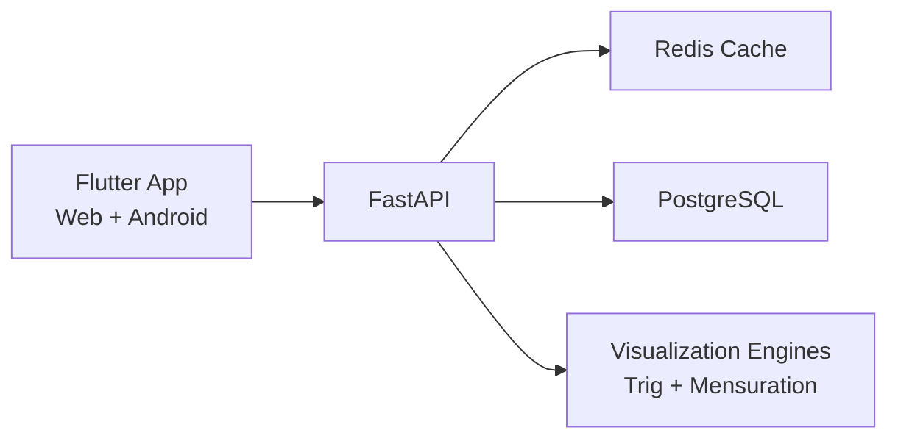
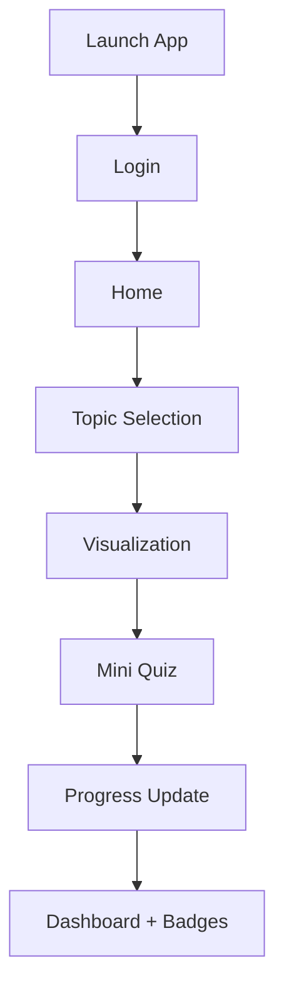

# Patashala

Patashala is a Class 6 learning app focused on visual math learning through interactive simulations.
It combines Flutter (Web + Android) with FastAPI + PostgreSQL + Redis.

## Project Goal
Help students understand:
- Trigonometry (basic visual concepts)
- Mensuration (area and perimeter)

Using:
- Interactive visualizations
- Simulation controls
- Step hints
- Mini quizzes
- Progress tracking

## Topics Covered
### Trigonometry
- Right Triangle Basics
- Sine & Cosine (visual)
- Angle Rotation
- Shadow Length Simulation

### Mensuration
- Area of Rectangle
- Area of Square
- Perimeter of Shapes
- Area by Grid Method

## Tools & Technologies Used
- Frontend: Flutter (`Dart`)
- Backend API: FastAPI (`Python`)
- Database: PostgreSQL
- Cache: Redis
- ORM: SQLAlchemy
- API Validation: Pydantic
- Testing: `flutter_test`, `pytest`
- Containerization: Docker, Docker Compose
- CI/CD Frontend: GitHub Actions + GitHub Pages
- Deployment Backend: Render

## System Architecture



## Learning Flow Sheet



## User Flow
1. Student logs in with username/password.
2. Home screen shows featured topics and progress ring.
3. Student chooses Trigonometry or Mensuration topic.
4. Student interacts with sliders/drag controls in visualization.
5. Student completes mini quiz.
6. App saves completion and updates dashboard stats.

## Key Features
- Neon dark UI with glass cards
- Simple login + remember session
- Settings drawer (hints, autoplay, sound, haptics, text size, logout)
- Global text scaling from settings
- Mensuration game-like interactions:
  - Drag handles
  - Animated measurement rulers
  - Tap-to-fill grid area
  - Step-by-step hints
- Trig visualizers with live sin/cos/tan cards

## Backend API Endpoints
- `GET /health`
- `GET /topics`
- `GET /visualization/{topic_id}`
- `POST /progress`
- `GET /progress/{user_id}`
- `POST /auth/login`
- `POST /auth/register`

## Local Run

### Backend
```bash
cd backend
python -m venv .venv
source .venv/bin/activate
pip install -r requirements.txt
python seed.py
uvicorn app.main:app --host 0.0.0.0 --port 8000
```

### Frontend (Web)
```bash
cd frontend
flutter pub get
flutter run -d web-server --web-hostname 0.0.0.0 --web-port 7361 --dart-define=API_BASE_URL=http://127.0.0.1:8000
```

## Test Commands
```bash
# frontend
cd frontend
flutter analyze
flutter test

# backend
cd ../backend
.venv/bin/python -m pytest -q
```

## Deployment (Sequential)

### 1) Backend -> Render
1. Push latest code to `main`.
2. In Render dashboard, click **New +** -> **Blueprint**.
3. Select this repository.
4. Render reads `render.yaml` and creates `patashala-api`.
5. Deploy and wait for **Live**.
6. Verify: `https://<your-render-url>/health`.

### 2) Frontend -> GitHub Pages
1. In GitHub repo settings, open **Pages**.
2. Set **Source** to **GitHub Actions**.
3. Ensure workflow file exists: `.github/workflows/frontend-pages.yml`.
4. Update workflow API URL if needed:
   - `--dart-define=API_BASE_URL=https://<your-render-url>`
5. Push to `main` (or run workflow manually in Actions tab).
6. After workflow success, open:
   - `https://sashank33v.github.io/patashala/`

## Demo Login
- Username: `student`
- Password: `student123`
