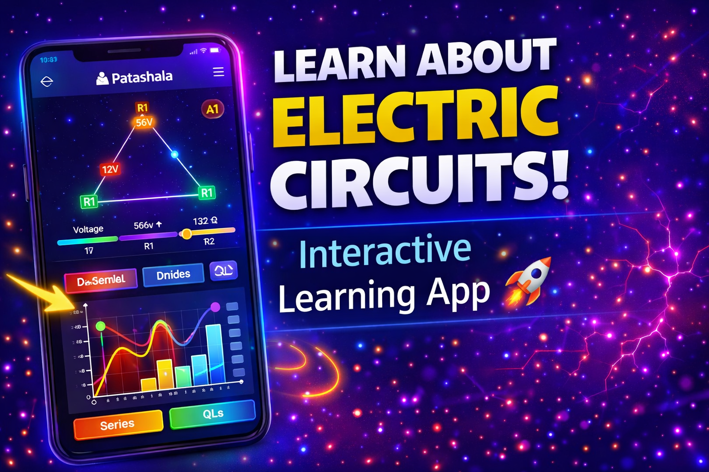
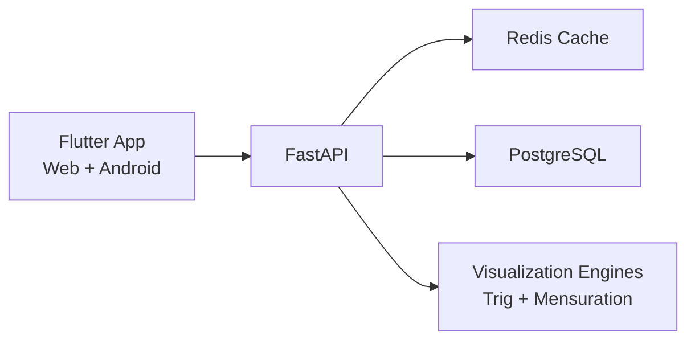
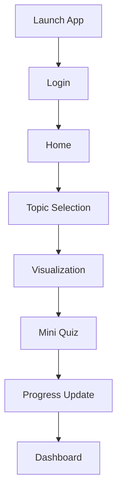

# Patashala

Patashala is a student interactive visualization app that transforms math learning into a guided, hands-on experience.
It combines simulation-first content, modern UX, and performance-focused engineering across web and mobile.

## Demo Video
[](https://youtu.be/i67CCsWdrDo)

## Project Structure
```text
.
├── .github
│   └── workflows
│       └── frontend-pages.yml
├── .gitignore
├── README.md
├── backend
│   ├── .dockerignore
│   ├── Dockerfile
│   ├── Procfile
│   ├── app
│   │   ├── __init__.py
│   │   ├── __pycache__
│   │   ├── app.py
│   │   ├── cache.py
│   │   ├── db.py
│   │   ├── engines
│   │   ├── main.py
│   │   ├── models.py
│   │   ├── schemas.py
│   │   └── topic_catalog.py
│   ├── patashala.db
│   ├── requirements.txt
│   ├── seed.py
│   ├── test_patashala.db
│   └── tests
│       ├── __pycache__
│       ├── conftest.py
│       └── test_api.py
├── docker-compose.yml
├── frontend
│   ├── .gitignore
│   ├── README.md
│   ├── analysis_options.yaml
│   ├── lib
│   │   ├── api_service.dart
│   │   ├── data
│   │   ├── main.dart
│   │   ├── screens
│   │   ├── services
│   │   └── widgets
│   ├── pubspec.lock
│   ├── pubspec.yaml
│   ├── test
│   │   ├── simulation_quiz_test.dart
│   │   └── widget_test.dart
│   └── web
│       ├── favicon.png
│       ├── icons
│       ├── index.html
│       └── manifest.json
└── render.yaml

17 directories, 34 files
```

## Vision
Build a learning product where students understand concepts by interacting with them, not by memorizing static text.

## Problem
Many students struggle with mathematics because:
- Concepts are explained abstractly instead of visually
- Learning is passive instead of exploratory
- Practice feedback is delayed and disconnected from intuition
- Progress tracking is often unclear and unmotivating

## Solution
Patashala delivers concept learning through real-time visual interaction.
Students can drag, slide, rotate, and tap visual models to discover how values change, then validate understanding through mini quizzes.

Core pillars:
- Visual learning: dynamic diagrams and graph-like views
- Interactive exploration: live controls and drag-based geometry
- Active learning: simulation-driven cause-and-effect
- Gamification: progress states, completion actions, and dashboard metrics

## Product Scope
### Trigonometry
- Right Triangle Basics
- Sine & Cosine (Visual)
- Angle Rotation
- Shadow Length Simulation

### Mensuration
- Area of Rectangle
- Area of Square
- Perimeter of Shapes
- Area by Grid Method

## Why Patashala (Differentiators)
- Interaction-first pedagogy over static lesson screens
- Reusable visualization architecture driven by topic metadata
- Consistent cross-platform experience (Flutter Web + Android)
- Fast API backend with cache layer for repeated simulation queries
- Product-ready UI system (glass cards, dark-neon visual identity, focused control hierarchy)

## System Architecture



## Product Flow Sheet



## User Flow
1. Student logs in with username/password.
2. Home screen presents featured concepts and progress snapshot.
3. Student enters a topic and manipulates visual controls.
4. Simulation updates instantly as parameters change.
5. Student attempts mini quiz for concept validation.
6. Progress is stored and reflected in dashboard analytics.

## Tools & Technologies
- Frontend: Flutter (`Dart`)
- Backend API: FastAPI (`Python`)
- Database: PostgreSQL
- Cache: Redis
- ORM: SQLAlchemy
- Validation: Pydantic
- Testing: `flutter_test`, `pytest`
- DevOps: Docker, Docker Compose
- CI/CD: GitHub Actions
- Hosting: GitHub Pages (frontend), Render (backend)

## Key Features
- Simple login with session persistence
- Home/dashboard settings with text scaling and interaction preferences
- Interactive trig visualizers with live sin/cos/tan values
- Game-like mensuration interactions:
  - Drag handles for dimensions
  - Animated ruler cues
  - Tap-to-fill grid area method
  - Step-by-step hint panels
- Mini quizzes + completion workflow
- Progress dashboard with summary and leaderboard view

## Backend API Surface
- `GET /health`
- `GET /topics`
- `GET /visualization/{topic_id}`
- `POST /progress`
- `GET /progress/{user_id}`
- `POST /auth/login`
- `POST /auth/register`

## Local Development
### Backend
```bash
cd backend
python -m venv .venv
source .venv/bin/activate
pip install -r requirements.txt
python seed.py
uvicorn app.main:app --host 0.0.0.0 --port 8000
```

### Frontend (Web)
```bash
cd frontend
flutter pub get
flutter run -d web-server --web-hostname 0.0.0.0 --web-port 7361 --dart-define=API_BASE_URL=http://127.0.0.1:8000
```

## Quality Checks
```bash
# frontend
cd frontend
flutter analyze
flutter test

# backend
cd ../backend
.venv/bin/python -m pytest -q
```

## Roadmap
- Adaptive learning recommendations based on weak-topic patterns
- Expanded subject catalog with richer simulation packs
- Teacher mode with class-level insights
- Achievement system upgrade (milestones, streak rewards, challenge modes)
- Offline-ready lesson packs for low-connectivity regions

## Demo Login
- Username: `student`
- Password: `student123`
